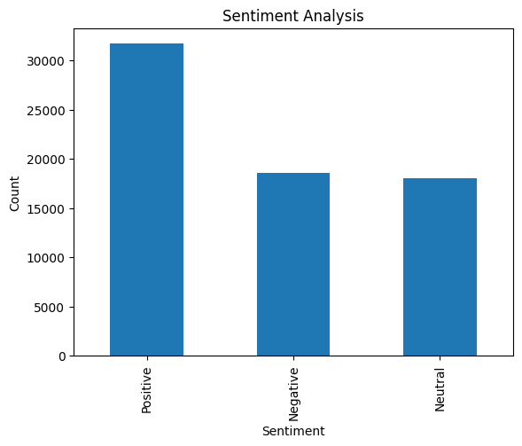

# Prodigy Infotech - Task 4

## 📊 Objective
Analyze and visualize sentiment patterns in social media data.

## 📁 Dataset
Twitter dataset from Prodigy Infotech.

## 🛠 Tools Used
- Python
- Pandas
- Matplotlib
- TextBlob

## 📈 Analysis
- Performed sentiment analysis on text data
- Classified sentiments into Positive, Negative, Neutral
- Visualized sentiment distribution using bar chart

## 📷 Output

## 📌 Conclusion
The analysis shows the overall public opinion trends in the dataset. Most of the sentiments can be categorized into positive, negative, and neutral groups.
